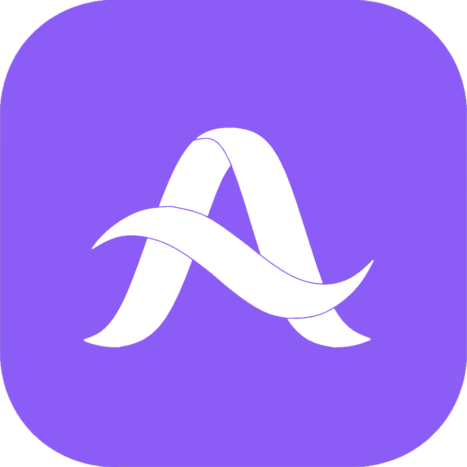

<div align="center">
  
  
</div>

A desktop AI assistant built with Electron, powered by [MiMo Code](https://github.com/XiaomiMiMo/MiMo-Code).

Aria Chat wraps the MiMo Code local server in a clean, Claude-desktop-style UI — two modes, real-time streaming, inline approvals, and a live workspace panel. No cloud dependencies; everything runs locally.

Built by [Junji at Project BomberCraft](https://github.com/gabrieljamh/MiMo-Tasker).

---

## Features

- **Chat mode** — throwaway sandboxed conversations. Each chat gets its own isolated folder so file operations never touch your real projects.
- **Tasker mode** — point at a project folder and describe a task. A live **Progress** checklist and **Files** panel track what the agent creates or edits alongside the conversation.
- **Real-time streaming** — tokens, tool calls, reasoning, and file changes stream live over SSE.
- **Inline approvals** — permission requests appear as cards in the conversation. Approve once, always allow, or deny without leaving the flow.
- **Multiple model/providers** — the model selector is populated live from the server. Add any OpenAI-compatible provider with an API key and base URL.
- **Multi-modal input** — attach images, audio recordings, video, and files via the composer. Vision/audio/video model redirects let you route attachments to specialized models.
- **Custom instructions** — per-conversation guidance saved into the global server config.
- **Auto-compaction** — keep long conversations within context limits with configurable token thresholds and an optional dedicated model.
- **Skills** — extend the agent with installable skill packs (`.skill` files, SKILL.md folders).
- **Settings** — General, Conversations, Models, Providers, Skills, Server, and About pages with full configuration.

## Getting started

### Prerequisites

- **Node.js 18+** and **npm**
- **Bun** (used to launch the MiMo Code server)

### Install & run (dev)

```bash
# 1. Clone the repo
git clone https://github.com/gabrieljamh/MiMo-Tasker.git
cd MiMo-Tasker

# 2. Install monorepo deps (Bun)
bun install

# 3. Install desktop app deps
cd desktop
npm install

# 4. Run in dev mode
npm run dev
```

The app **auto-starts a local MiMo Code server** on `127.0.0.1` with a random port. A splash screen shows progress until the server is ready.

### Attaching to an already-running server

Run the server yourself:

```bash
# from the repo root
bun run --conditions=browser packages/opencode/src/index.ts serve --port 4096
```

Then open **Settings → Server** in the app and set the URL to `http://127.0.0.1:4096`, or launch with:

```bash
MIMO_SERVER_URL=http://127.0.0.1:4096 npm run dev
```

### Build a portable copy

```bash
cd desktop
npm run pack
```

This produces `dist-portable/` with `aria-chat.exe`, the Electron runtime, and the compiled server binary — no install needed. A zip archive is created alongside it.

## Architecture

Aria Chat follows a strict three-layer Electron architecture:

```
Main Process (Node)          → spawns server, runs HTTP/SSE client, IPC bridge
  ↓  contextBridge (window.mimo)
Preload                      → typed pass-through to IPC
  ↓  window.mimo.*
Renderer (React)             → UI only, never talks to the server directly
```

**Adding a server feature requires touching all three layers in lockstep:**
1. `src/shared/types.ts` — add the method to the `MimoApi` interface
2. `src/preload/index.ts` — wire it to `ipcRenderer.invoke`
3. `src/main/ipc.ts` — register the `ipcMain.handle` handler

See [`desktop/ARCHITECTURE.md`](./desktop/ARCHITECTURE.md) for the full module map, data flow, and state model.

## Server patches (required for the desktop app)

The upstream MiMo Code server is designed for a single TUI client. Aria Chat patches the server in a few places so that multi-instance desktop sessions work correctly. These changes live in `packages/opencode/` and must be preserved when merging upstream:

### 1. GlobalBus SSE subscription — `src/server/routes/instance/event.ts`

The stock server only subscribes to the local `Bus` for the request's directory instance. When the desktop app creates multiple sessions (chat sandboxes, tasker projects), events from instances other than the repo root never reach the SSE stream — so streamed tokens, tool calls, and state updates silently disappear.

**Fix:** subscribe to `GlobalBus` in addition to `Bus`, so events from all instances are forwarded to the connected client. The `GlobalBus.on("event", onGlobal)` listener pushes each payload into the SSE queue; cleanup calls `GlobalBus.off` on disconnect.

### 2. Auto-compaction threshold — `src/config/config.ts` + `src/session/overflow.ts`

Upstream only supports compaction triggered by the model's reported context limit. The desktop app exposes a user-configurable **compaction threshold** (token count) so users can cap context at e.g. 100K regardless of the model's limit.

**Fix:** add `threshold` (optional `NonNegativeInt`) to the compaction schema in `config.ts`. In `overflow.ts`, `isOverflow()` and `pressureLevel()` check `compaction.threshold` first — if set, it overrides the model's reported limit as the trigger point and pressure-calculator denominator.

### 3. Prompt cache key gate — `src/provider/transform.ts`

Upstream set `promptCacheKey` for all of `openai` unconditionally, or whenever `providerOptions.setCacheKey` was truthy. This sends cache keys to providers that don't support them (causing errors or silent waste).

**Fix:** introduce `supportsPromptCacheKey` — an explicit allowlist (`venice`, `openrouter`, `opencode*`, `@ai-sdk/azure`, openai gpt-5). `promptCacheKey` is only set when `setCacheKey` is true **and** the provider is on the list. Additionally, the opencode-provider reasoning/reasoningSummary block now guards against `@ai-sdk/openai-compatible` (generic adapter shouldn't receive opencode-specific options).

### 4. TUI streaming race condition — `src/cli/cmd/tui/context/sync.tsx`

When a `message.part.updated` event arrives with text that's shorter than what delta accumulation has already built in the store, the full-part update would overwrite the accumulated (longer) text — visible as tokens momentarily disappearing during streaming.

**Fix:** in `sync.tsx`, if the incoming part is a text type and the store already has text that's equal or longer, skip the update (break instead of overwrite). Also handles out-of-order `message.part.delta` events by creating a placeholder part when the part isn't found yet.

## Development

| Command | Description |
|---------|-------------|
| `npm run dev` | Start dev server with hot reload (from `desktop/`) |
| `npm run build` | Production build to `out/` (from `desktop/`) |
| `npm run typecheck` | Type-check both main (Node) and renderer (web) (from `desktop/`) |
| `npm run pack` | Build portable exe + zip (from `desktop/`) |
| `bun run typecheck` | Type-check all monorepo packages (from root) |
| `bun run lint` | Run oxlint (from root) |

Single CSS file: `desktop/src/renderer/styles.css`. CSS variables for theming. No CSS-in-JS or Tailwind.

## Troubleshooting

**"Server not starting" / "Could not find repo root"**
→ The server launcher walks up from `desktop/` to find `packages/opencode`. Alternatively, set `MIMO_SERVER_URL`.

**Blank conversation / no streaming**
→ Ensure the server's SSE endpoint includes the `GlobalBus` subscription (see `packages/opencode/src/server/routes/instance/event.ts`). Restart the server after changes.

**Models not showing in the selector**
→ Open **Settings → Providers**, add a provider with an API key and model ID, then save. The model appears in the composer dropdown immediately.

## License

Copyright &copy; 2026 MiMo Code, Xiaomi Corporation  
Copyright &copy; 2025 opencode

Both under the MIT License. See [LICENSE](./LICENSE) for details.

## Support

If you find Aria Chat useful, consider supporting its development:

[](https://ko-fi.com/gabrieljamh) [](https://www.paypal.com/donate/?business=8Y2R4BCT7XF6E&no_recurring=0&currency_code=USD)
